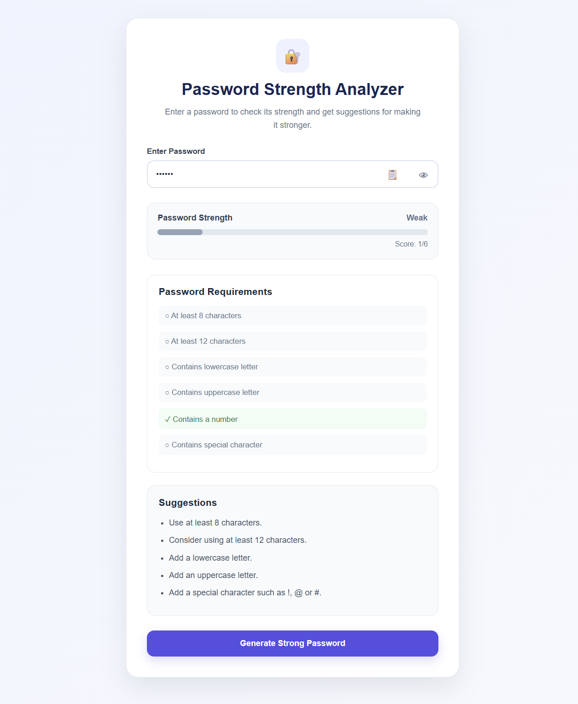
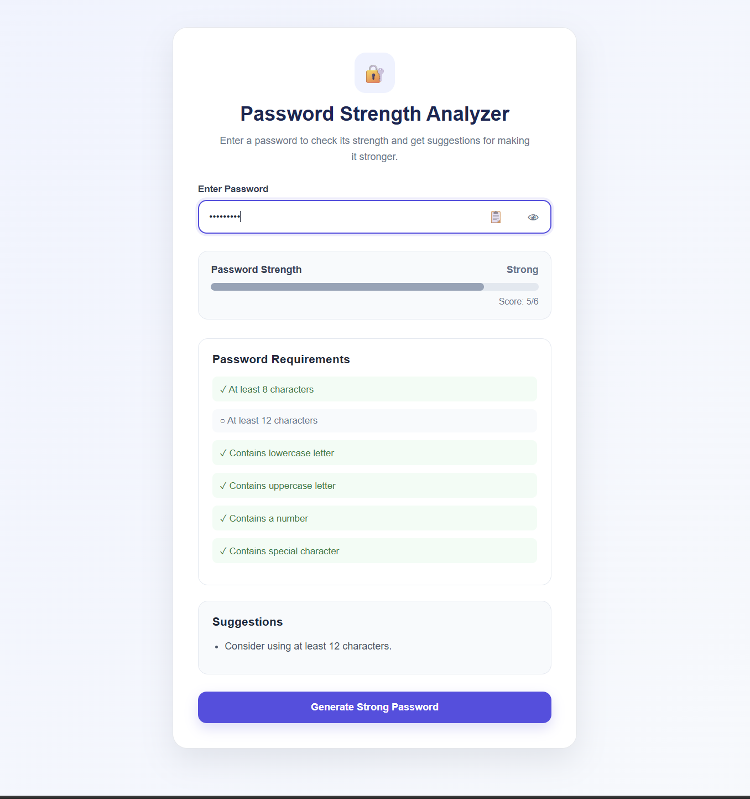

# Password Strength Analyzer

A web-based Password Strength Analyzer that evaluates user-entered passwords based on length, complexity, and common password patterns.

## Features

- Check password length
- Check for lowercase letters
- Check for uppercase letters
- Check for numbers
- Check for special characters
- Detect common passwords
- Calculate password strength
- Display Weak, Medium, Strong, or Very Strong
- Provide suggestions for improving passwords
- Generate strong password alternatives
- Show or hide password
- Copy password to clipboard
- Responsive design for desktop and mobile

## Technologies Used

- HTML5
- CSS3
- JavaScript

## How It Works

The user enters a password into the password field.

JavaScript analyzes the password using several checks:

1. Password length
2. Lowercase characters
3. Uppercase characters
4. Numbers
5. Special characters
6. Common password detection

Points are assigned based on the results.

The final score determines the password strength:

| Score | Strength |
|---|---|
| 0–2 | Weak |
| 3–4 | Medium |
| 5 | Strong |
| 6 | Very Strong |

The application also provides suggestions to help users improve weak passwords.

## Project Structure

```text
Password-Strength-Analyzer/
│
├── index.html
├── style.css
├── script.js
├── README.md
├── .gitignore
│
└── screenshots/
## Screenshots

### Home Page


### Weak Password



### Strong Password


- - - - - - - - - 
## Author

Thirumagan K A
